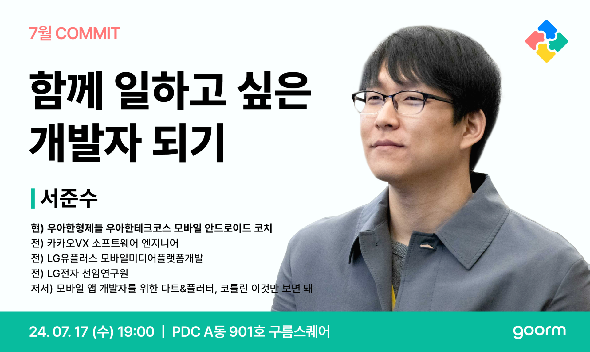

저번 주 수요일, 7월 COMMIT에 오프라인 참석자로 선정되어 판교 구름에 다녀왔습니다. 7월 COMMIT의 주제는 **"함께 일하고 싶은 개발자 되기"** 입니다. 졸업을 앞두고 취업을 준비하면서 회사에서 함께 일하기 좋은 개발자는 어떤 개발자인지 궁금해서 신청하게 되었습니다. 이번으로 구름 COMMIT은 세 번째 참석하게 되었는데, 아침부터 엄청나게 많은 비가 쏟아진 탓인지 빈 자리가 너무 많았습니다. 발표자를 위해 빈 자리가 느껴지지 않도록 열심히 박수도 치고, 호응도 하면서 준수님의 이야기에 더욱 귀 기울였습니다.

함께 일하고 싶은 개발자는 사람마다 기준이 다를 수 있으며, 준수님의 주관적인 생각과 경험을 공유하는 자리라고 말씀하시며 발표가 시작되었습니다.

&nbsp;

---

&nbsp;

#### 키워드

#협업 #목표 #소통 #신뢰 #관계 #교육

&nbsp;

## 1. 협업

- 협업이란 함께 일하는 것
- 본업을 바탕으로 다른 업을 가진 사람과 소통하는 것

### 왜 중요한가?

> "팀보다 위대한 선수는 없다." - 알렉스 퍼거슨

- 스타플레이어보다 팀워크
- 복잡해지는 개발
  - 혼자보다는 협업
  - AI로 인한 개발 단순화? → AI와의 협업
- 다양한 직군과 함께 일하는 개발자
  - 기획자, 디자이너, QA 엔지니어 등

### 무엇을 위해 협업하는가?

- 하나의 스마트폰을 출시하는 데 필요한 인원이 몇명일까?
- 그 많은 사람들이 도대체 무슨 일을 함께하는 걸까?
- 협업의 목표
  - **공동의 목표 달성**이 목표

&nbsp;

## 2. 목표

- 공동의 목표 달성에서 공동의 범위는 어디까지일까?
- 정말 같은 목표를 바라보고 있는 걸까?

### 업무에 임하는 당사자가 바라보는 목표

> LG 입사 후 연수원에 계실 당시, 미화원님과의 일화를 이야기해주셨습니다.

- 단순히 방을 청소하는 것?
  - 나의 성장에 기여하고 있는 분
  - 인재개발팀의 역할
  - 나아가 제품 개발에 일조한 것
- 어떤 마음으로 본업에 임하셨을까?

### GRIT: 생업과 직업, 그리고 천직

> 세 벽돌공에게 물었다. "무엇을 하고 있습니까?"
>
> 첫 번째 벽돌공이 대답했다. "벽돌을 쌓고 있습니다"  
> 두 번째 벽돌공이 대답했다. "교회를 짓고 있습니다"  
> 세 번째 벽돌공은 이렇게 말했다. "하느님의 성전을 짓고 있습니다."
>
> 첫 번째 벽돌공은 **생업**을 갖고 있다.  
> 두 번째 벽돌공은 **직업**을,  
> 그리고 세 번째 벽돌공은 **천직**을 갖고 있다.

#### 나는 어떤 벽돌공이었을까?

- 전세계 수천만 명의 사람들이 사용하는 앱을 만들고 있다.
- 스마트폰 출시라는 공동의 목표에 정확히 부합하는 것은 아니다.
- 그때나 지금이나 여전히 유효한 꿈
  - "많은 사람들에게 사랑받는 프로그램을 만드는 것"

#### 어떤 벽돌공이 함께 일하고 싶은 사람인가?

- 정성들여 잘 할 것이라는 전제가 필요 → 세 번째 벽돌공
  - 하지만 만약 벽돌 쌓는 기술이 부족하다면?
- 협업을 잘하기 위한 공동의 목표 설정은 매우 중요한 문제
  - 공동의 목표 설정을 위해서는 서로의 생각 공유 → **소통**

&nbsp;

## 3. 소통

### 개발자 특유의 억센 말투

- 억센 말투
- 온라인 + 텍스트

#### 소통 방식 개선하기

> 개발자: 별로 어려운 것도 아니고 공식 문서에 잘 나와있으니 읽어보면 됩니다.
>
> 공식 문서는 읽어 보셨을까요?  
> 읽어보셨다면 구체적으로 어떤 어려움이 있으신가요?  
> 공식 문서에 해당 내용 설명이 잘 되어 있는데 참고해 보면 어떨까요?

#### 개발자만의 문제가 아니다!

- 결국 **사람의 문제**

> UX 디자이너: 이 앱에서는 되는데요?
>
> OO 앱 써보셨나요?  
> 제가 원하는 효과가 해당 앱과 유사한데요.  
> 프레임워크 자체 지원인지 커스텀 개발한 것인지 같이 조사해 보면 어떨까요?  
> 아무래도 기술적인 부분은 개발자님이 더 잘 아시니까요.

#### 긍정적으로 소통하기

> 제가 모를 뿐이지 방법이 있을 거에요.  
> 보통 소프트웨어적으로 불가능한 것은 거의 없으니까요.  
> 찾아보고 말씀드릴게요.

### 이건 좀...

- 부정적 말투
- 패배주의
- 대충

### 소통에 도움이 된 방법

- 본인이 **편한 방식**으로 먼저 소통
  - 글 (장문, 단문)
  - 말

#### 개발자의 소통

- 코드
- 커밋 메시지
- 협업툴(ex. Jira)

#### 소통의 종류

- 공동의 목표 설정을 위해 생각을 나누는 소통
- 업무적 문제 해결을 위한 소통
- **일상 이야기를 나누는 소통** → 사람 사이의 신뢰를 쌓는 방법

&nbsp;

## 4. 신뢰

### 신뢰와 진심의 무한 루프

- 신뢰는 진심에서 나온다.
- 진심은 신뢰에서 나온다.

### 신뢰를 쌓는 방법

- 기술적 역량
- 문제해결력
- 그 외 각종 좋은 말들

#### Yes Man

> 이걸 왜 해야 하죠?

- 일단 하고, 요구해라.
- 안되는 이유 100가지보다 되는 이유 한가지

#### 뜻 밖의 신뢰

- 1주 이상 걸릴 것이라고 생각한 것 하루 이틀 안에 끝내기
- 일 스택이 쌓여 있는 것을 불편해 하는 성격이었을 뿐.
  - 의도치 않게 신뢰가 쌓임 → 완전 럭키비키잖아 🍀

#### 일정 준수

> 이거 언제까지 할 수 있어요?

- 일정 산정은 어렵다.
- 나도 잘 모르겠을 때
  - 2일이라고 하면 못할거같고 일주일이라고 하면 게을러보일거같고..
  - 어떻게 대답해야하지?
- 시간이 더 필요할 것 같으면 미리 말하기
- 모르는 것을 모른다고 빠르게 오픈하는 마인드
- 나의 일정만 있는 것이 아님! - 다른 팀의 일정까지도 고려해야한다.
- **기본 중의 기본**

### 나는 잘하는 사람이 아니다.

> 콜백 구조로 받아와야 하는 것을 일단 빠르게 완료하려는 욕심 때문에 static으로 접근  
> 리뷰 요청을 하면서도 "이건 좀 아닌 것 같다..."  
> 역시나 혼이 났다!

- 이런 사람과 일하고 싶은가?
- 신뢰 복구를 위해서 더욱 신중히 커밋

&nbsp;

## 5. 관계

### 적절한 관계의 선

- 친구와 동료의 중간
- 친구보다 먼, 동료보다 가까운

### 가족 관계에서도 문제가 있을 수 있다.

- 정봉이 어머니의 부재
- 본인의 부재에도 집안이 잘 돌아가는 것에 대한 섭섭함

#### 무엇이 문제일까?

- 정봉이 어머니는 스타플레이어?
  - 만약 리더였다면?
  - 다른 사람에게 일을 넘기는 것은 무책임한 것일까?
  - 공동의 목표라는 관점에서 생각하면?

#### 왜 이런 일이 발생했을까?

- 목표의 불일치
- 소통의 오류
- 결국 관계에 영향을 줌 → 악순환 발생

### 좋은 관계를 유지하려면...

- 우리는 모두 다 같은 직장인, 조직의 구성원이다.
- 개발자라고 특별하지 않다.
- 어깨에 힘주지 말자.
- 겸손하자.

> 어허 내가 전문가인데 어딜!

- 존경심은 강요하는 것이 아니라 **자발적으로 우러러 나오는 것**

### 함께 일하고 싶은 개발자가 되려면...

- 협업하고 싶은 사람
- 공동의 목표 설정
- 목표 합의를 위한 소통
- 소통을 통한 신뢰 형성
- 신뢰를 바탕으로 한 관계

- 협업을 더 잘할 수 있는 **선순환** 구조

&nbsp;

## 6. 교육

> 우아한 테크 코스와 이어지는 내용입니다.

### 목표와 비전

- 장인 정신을 가진 인재 양성
- 소프트웨어 생태계에 선한 영향력

### 소프트 스킬과 하드 스킬

- 어느 하나만 갖춰선 안된다.

#### 페어 프로그래밍

- 내비게이터와 드라이버
- 갈등을 빠르게 드러내어 발생할 문제를 빠르게 경험
- 동일한 목표 달성을 위해 소통하며 협업

#### 코드 리뷰

- 코드리뷰에 진심인 편
- 현업 개발자와 소통
- 수평적인 관계 형성
  - 닉네임 사용

#### 글쓰기, 회고, 피드백

- 글쓰기 미션도 수료 조건
- 회고와 피드백
- 자신의 지식과 생각을 효과적으로 전달

&nbsp;

---

&nbsp;

발표를 들으면서 준수님이 협업과 관련해서 평소에 하시는 생각들을 전달받을 수 있었습니다. 동시에 따뜻하고 겸손함을 갖추신 분이라는 것도 느껴졌습니다. 함께 일하고 싶은 사람이란 이런 사람이겠다는 생각이 들었습니다.

저는 지금까지 개발이 재미있어서 해왔지만, 개발을 통해서 이루고 싶은 궁극적인 목표는 무엇이었을까 깊게 생각해본 적이 없었습니다. 회사에서는 회사의 목표가 있을 것이고, 또 이를 위한 팀의 목표가 있을 것이고, 나는 그 구성원으로써 어떤 목표를 가지고 개발을 해야 할 지 고민하는 개발자가 되어야 겠습니다.

> 솔직한 게 진실된 거라 생각하는 착각.  
> 변명이나 핑계를 위해 사람은 얼마든지 솔직할 수 있다.  
> 진실과 별개로.

신뢰에 대한 이야기를 들으면서 계속해서 생각나는 미생의 한 장면이었습니다. 최근 LinkedIn을 통해서 [[솔직함의 함정]](https://kr.linkedin.com/posts/inho-kwon-b05388137_%EC%86%94%EC%A7%81%ED%95%A8%EC%9D%98-%ED%95%A8%EC%A0%95-%ED%95%9C-%EB%8C%80%EA%B8%B0%EC%97%85%EC%9D%98-%EB%A9%B4%EC%A0%91-%ED%98%84%EC%9E%A5-%ED%83%80-%EA%B8%B0%EC%97%85%EC%97%90%EC%84%9C-%EC%9D%B8%ED%84%B4-%EA%B2%BD%ED%97%98%EC%9D%B4-%EC%9E%88%EB%8D%98-activity-7215524410290552832-kq-I?utm_source=li_share&utm_content=feedcontent&utm_medium=g_dt_web&utm_campaign=copy)이라는 글을 본 적이 있는데, 글과 연결지어서 신뢰를 위해서는 **진심**을 전달할 수 있어야 한다는 생각도 들었습니다. 솔직하면서도 상대에 대한 존중이 묻어나는 말하기가 가진 힘을 발표를 통해서 다시 한 번 느낄 수 있었습니다.

어떤 사람과 함께 일하고 싶은지 생각해보고, 나는 그런 사람이 되기 위해 노력하고 있는지 저 자신을 되돌아 봐야겠습니다.
