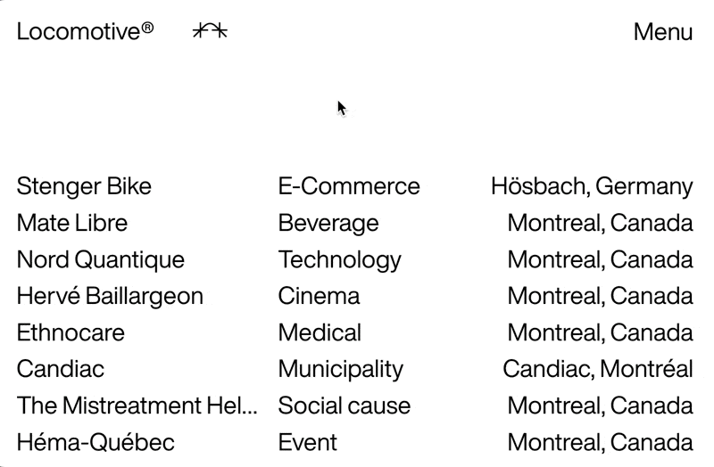
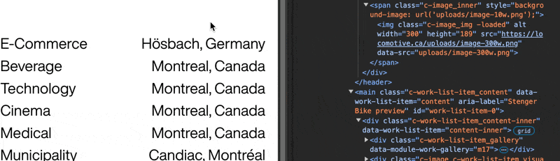
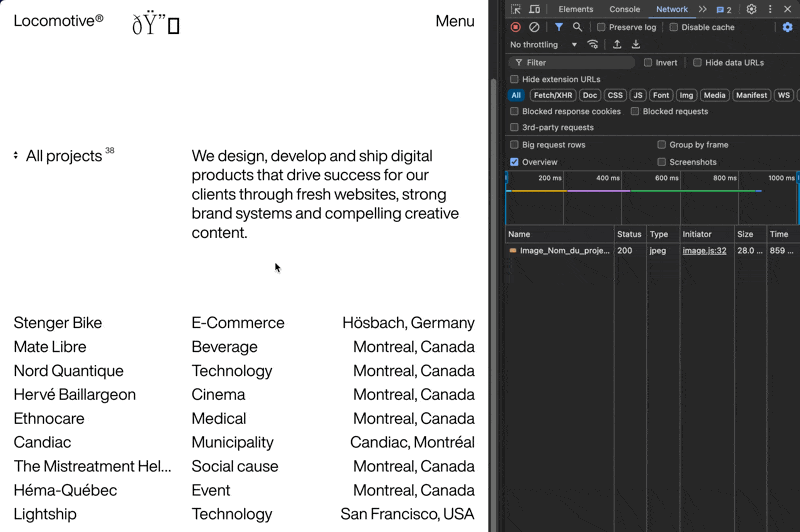
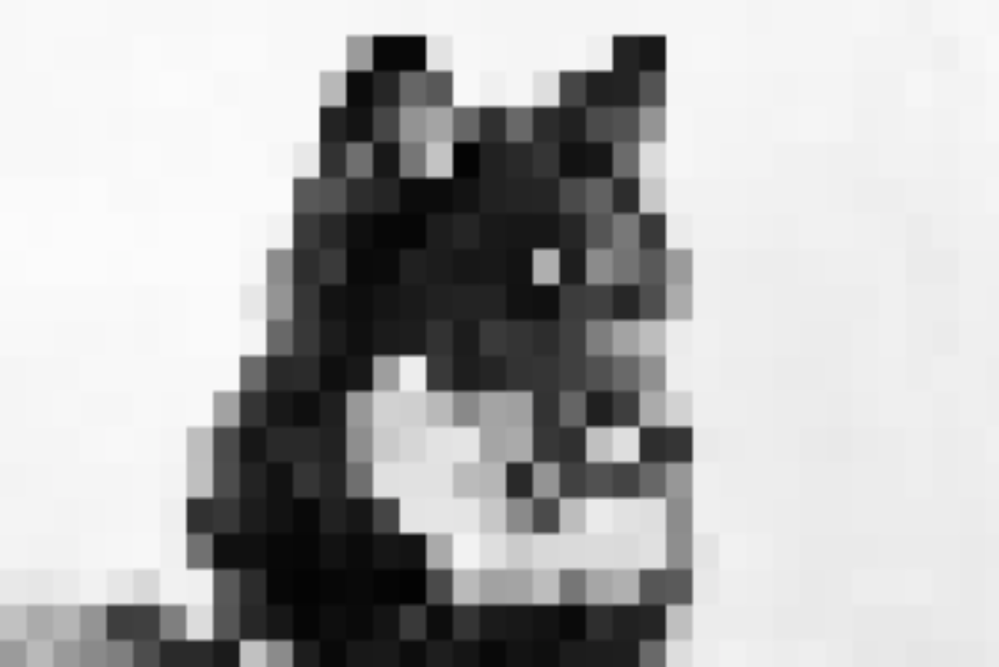

[Awwwards](https://www.awwwards.com/)에서 레퍼런스를 찾으면서 눈 호강을 하던 중 한 가지 재미있는 인터랙션을 발견했습니다.
매우 많은 **SOTD**(Site Of The Day)를 수상한 캐나다의 [Locomotive](https://locomotive.ca/)라는 웹 에이전시 홈페이지의 이미지 전반에 적용된 애니메이션이었습니다.



마치 처음에는 이미지 로딩이 덜 된 것 같은 저화질의 픽셀 이미지에서 점점 고화질로 변화하는 애니메이션인데,
보는 사람 입장에서 재미도 있지만 Lazy Loading과 함께 적용하면 사용자 경험 측면에서도 제법 훌륭한 인터랙션이라고 생각했습니다.

&nbsp;

## 구현에 앞서



공개된 소스 코드나 레포지토리가 없어서 접근 방법에 대한 힌트를 얻고자 개발자 도구 창을 열고 커서를 이리저리 움직이며 이미지 주변의 DOM 변화를 관찰했습니다.
구체적으로는 알 수 없었지만, 대략적으로는 이미지가 불러와지기 전에 표시할 Blur 이미지를 배경으로 깔고
이미지가 불러와지면 `canvas`로 구현한 필터가 적용되었다가 사라지는 방식으로 구현한 것을 확인할 수 있었습니다.



그리고 네트워크 탭에서 이미지가 불러와지는 시점 또한 확인해서 Lazy Loading이 적용되어있음을 알 수 있었습니다.

&nbsp;

이렇게 알아낸 정보를 가지고, 방법을 구체화해 보았습니다.

1. 원본 이미지가 불러와지기 전에 표시될 대체 이미지를 만든다.
2. `next/image`의 `Image`를 사용해 대체 이미지를 `blurDataUrl`로 넣고, Lazy Loading을 구현한다.
3. 이미지를 `canvas`로 덮는다. (absolute)
4. `canvas`에 Pixelation 필터 기능을 추가한다.
5. `useEffect`와 `setInterval`, 클린업 함수를 사용해 시간의 흐름에 따른 Pixel의 크기를 제어한다.

위의 방법대로 `Next.js`, `TypeScript`, `Tailwind CSS`를 사용해 Lazy Loading 애니메이션을 구현해보았습니다.
대체 이미지는 블로그에 사용된 `Velite`에서 이미지를 처리하면서 생성된 `blurDataUrl`을 사용했습니다.
(Locomotive 웹사이트는 `Vue` 기반으로 작성되어있습니다.)

&nbsp;

## Lazy Loading 구현
`loading="lazy"`는 `next/image`의 기본값이기 때문에 특별히 작성해줘야 할 코드는 없습니다.
`Velite`에서 생성한 `blurDataUrl`을 `Image`의 속성으로 추가해줍니다.
`next/image`의 `blurDataUrl` 속성은 `placeholder="blur"`가 함께 작성되어야 작동합니다.

```tsx
return (
  <div className="flex">
    <div className="relative">
      <Image
        src="/image.jpg"
        alt="image"
        placeholder="blur"
        blurDataURL="data:image/webp;base64,..."
        width={640}
        height={360}
      />
      <canvas className="absolute top-0 left-0 h-full w-full" />
    </div>
  </div>
)
```

&nbsp;

## Pixelation 필터 구현
필터 구현을 위해 `Image`와 `canvas`를 `ref` 속성으로 참조해줍니다.

```tsx
'use client'

...

const canvas = useRef<HTMLCanvasElement>(null)
const image = useRef<HTMLImageElement>(null)

...

<Image
  ...
  ref={image}
/>
<canvas ref={canvas} ... />
```

그리고 `useEffect` 내부에 이미지를 `canvas`로 불러와서 구간(`pixelSize`) 별로 사각형에 색을 추가하도록 Pixelation 필터를 구현해줍니다.

```tsx
useEffect(() => {
  if (canvas.current && image.current) {
    const ctx = canvas.current.getContext('2d')
    const img = image.current

    if (ctx) {
      const width = canvas.current.width
      const height = canvas.current.height

      ctx.drawImage(img, 0, 0, width, height)

      const pixelSize = 12

      const imageData = ctx.getImageData(0, 0, width, height)
      const data = imageData.data

      for (let y = 0; y < height; y += pixelSize) {
        for (let x = 0; x < width; x += pixelSize) {
          const i = (y * width + x) * 4

          ctx.fillStyle = `rgb(${data[i]}, ${data[i + 1]}, ${data[i + 2]})`
          ctx.fillRect(x, y, pixelSize, pixelSize)
        }
      }
    }
  }
}, [])
```

여기에서 사용된 `pixelSize` 변수는 렌더링과 연관되어있는 값이기 때문에 최종적으로는 `state`로 분리되어야 합니다.

결과물을 확인해보면 Pixelation 필터가 잘 적용된 것을 확인해볼 수 있습니다.



&nbsp;

## Pixel 크기 제어

시간에 따른 `pixelSize`를 제어하기 위해 위의 `useEffect` 코드에서 사용되었던 `pixelSize`를 상태로 분리해줍니다.
그리고 `pixelSize` 값이 변함에 따라 필터를 새로 적용해야 하므로 기존 `useEffect`의 의존성 배열에 `pixelSize` 상태를 추가해줍니다.

새로운 `useEffect` 내부에 `setInterval`과 클린업 함수를 사용해 `pixelSize` 상태값을 변경하는 코드를 작성해줍니다.
그리고 이 `interval`은 `pixelSize`가 1보다 작아지면 중단되어야 합니다.

```tsx
const [pixelSize, setPixelSize] = useState(128)

useEffect(() => {
  const intervalId = setInterval(() => {
    setPixelSize((prevSize) => {
      const newSize = prevSize / 2
      if (newSize < 1) {
        clearInterval(intervalId)
        return 1
      }
      return newSize
    })
  }, 100)

  return () => clearInterval(intervalId)
}, [])
```

&nbsp;

## 결과


### 전체 코드

```tsx
'use client'

import { useEffect, useRef, useState } from 'react'
import Image from 'next/image'

function ImageLazyLoading() {
  const canvas = useRef<HTMLCanvasElement>(null)
  const image = useRef<HTMLImageElement>(null)
  const [pixelSize, setPixelSize] = useState(128)

  useEffect(() => {
    const intervalId = setInterval(() => {
      setPixelSize((prevSize) => {
        const newSize = prevSize / 2
        if (newSize < 1) {
          clearInterval(intervalId)
          return 1
        }
        return newSize
      })
    }, 100)

    return () => clearInterval(intervalId)
  }, [])

  useEffect(() => {
    if (canvas.current && image.current) {
      const ctx = canvas.current.getContext('2d')
      const img = image.current

      if (ctx) {
        const width = canvas.current.width
        const height = canvas.current.height

        ctx.drawImage(img, 0, 0, width, height)

        const imageData = ctx.getImageData(0, 0, width, height)
        const data = imageData.data

        for (let y = 0; y < height; y += pixelSize) {
          for (let x = 0; x < width; x += pixelSize) {
            const i = (y * width + x) * 4

            ctx.fillStyle = `rgb(${data[i]}, ${data[i + 1]}, ${data[i + 2]})`
            ctx.fillRect(x, y, pixelSize, pixelSize)
          }
        }
      }
    }
  }, [pixelSize])

  return (
    <div className="flex">
      <div className="relative">
        <Image
          src="/image.jpg"
          alt="image"
          placeholder="blur"
          blurDataURL="data:image/webp;base64,UklGRjIAAABXRUJQVlA4ICYAAACQAQCdASoIAAUADMDOJaQAAlw+c6AA/N1PdIpY7181Qu2DaIAAAA=="
          width={640}
          height={360}
          ref={image}
        />
        <canvas ref={canvas} className="absolute top-0 left-0 h-full w-full" />
      </div>
    </div>
  )
}

export { ImageLazyLoading }
```

&nbsp;

---

&nbsp;

이렇게 `canvas`와 애니메이션을 활용해서 보다 부드럽게 연결되는 Lazy Loading을 구현해봤습니다.
결과물은 [craft.wontory.dev](https://craft.wontory.dev)에서도 확인해보실 수 있습니다!