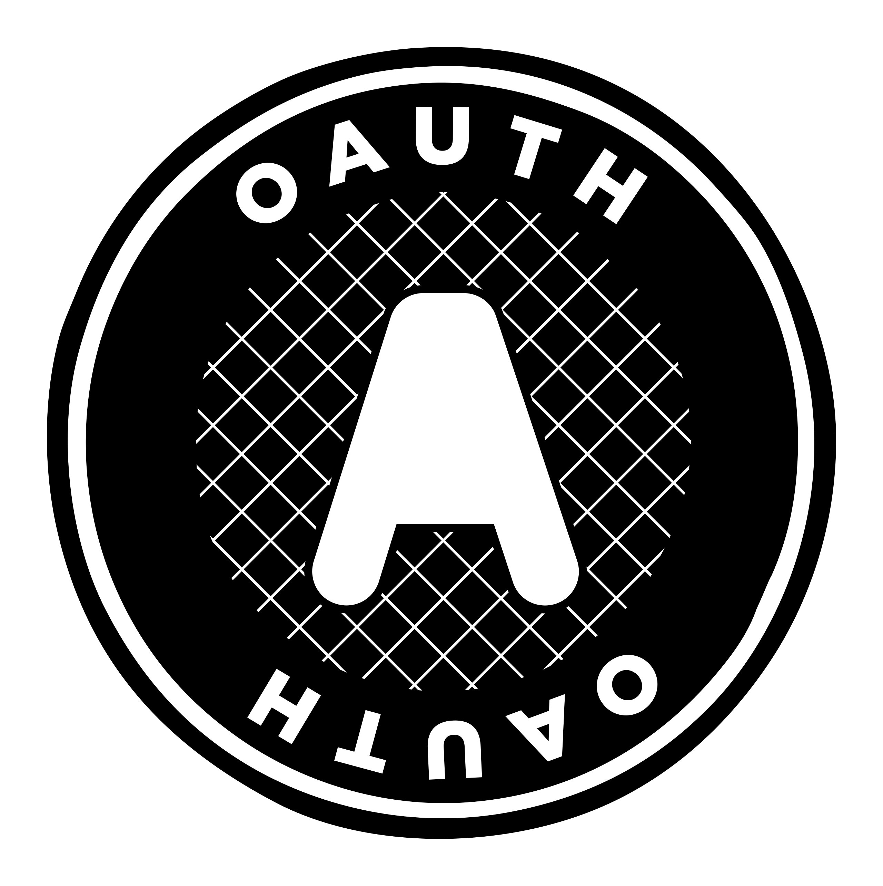

권한은 **인증과 인가**(Authentication & Authorization)로 나눌 수 있습니다. 그렇다면 OAuth에서 Auth는 어떤 것을 의미하는 것일까요?

&nbsp;

---

&nbsp;

## OAuth는 어떻게 탄생했을까?

최근 여러 서비스들에서 사용자로 하여금 OAuth를 통해 로그인을 하도록 유도하는 것을 어렵지 않게 볼 수 있습니다. 회원가입과 로그인 절차가 간소화되는 장점 때문이죠. 이 때문에 우리는 OAuth의 Auth가 인증을 의미한다고 생각할 수 있습니다. 하지만 OAuth는 사실 인증을 위해 생겨난 개념이 아닙니다. 서비스와 서비스 사이의 권한을 인가하기 위해 탄생한 것인데요. 지금부터 한가지 재미있는 예시를 통해 OAuth를 살펴보도록 하겠습니다.

&nbsp;

### 사진 인쇄 서비스

우리는 사진 인쇄 사업을 하고 있고, 이를 위한 웹사이트를 개발하려고 합니다. 우선 사진을 업로드할 수 있는 기능이 필요하겠네요. 하지만 요즘 사진을 기기에 저장하는 사람은 보기 드뭅니다. 클라우드에 업로드하죠. 이에 우리는 구글 드라이브 등을 통해 사진을 불러오도록 하고 싶습니다. 그러기 위해 우리는 사용자의 구글 계정을 연결해서 그들의 사진에 접근해야합니다.

어떻게 해야 할까요?

구글 드라이브에 접근하기 위해서는 구글 인증이 필요합니다. 사용자로부터 직접 구글 아이디와 비밀번호를 얻는다면 가능하겠네요. 하지만 이 방법은 무리가 있습니다. 사용자는 우리를 신뢰하지 않기 때문에 자신의 아이디와 비밀번호를 알려주고 싶지 않을 것입니다. 그리고 우리는 사용자의 민감한 정보를 저장 및 관리해야 하는 부담이 있고, 구글의 입장에서도 자신의 사용자 정보를 우리에게 맡기는 것이 안심되지 않을 것입니다.

여기에서 OAuth가 탄생하게 됩니다.

OAuth(Open Authorization)란 인터넷 사용자들이 비밀번호를 제공하지 않고 다른 웹사이트 상의 자신들의 정보에 대해 웹사이트나 애플리케이션의 접근 권한을 부여할 수 있는 공통적인 수단으로서 사용되는, 접근 위임을 위한 개방형 표준입니다.
현재는 OAuth가 2.0까지 발전했으며, 대부분 OAuth 2.0이 사용되고 있습니다.

&nbsp;

## OAuth의 흐름

OAuth의 흐름을 간단히 알아보겠습니다.

우리의 서비스는 구글 드라이브에 사용자의 사진을 요청합니다.
구글 드라이브는 사용자에게 이 요청을 허가할 것인지 확인하게 되고, 허가한다면 우리 서비스에 토큰(OAuth Access Token)을 발급합니다.
이제 이 토큰을 이용하면 우리는 사용자의 구글 드라이브에 제한적으로 접근할 수 있게 됩니다.

조금 더 자세히 살펴보기 위해 사용되는 용어를 알아보겠습니다.

&nbsp;

### Terminologies

- (Protected) Resource
  - 구글 드라이브의 사진
- Resource Owner
  - 사진 소유자(유저)
- Resource Server
  - 구글 드라이브
- Authorization Server
  - 구글
- Client
  - 사진 인쇄 서비스

&nbsp;

여기서 Authorization Server는 클라이언트에 Access Token을 발행하는 역할을 합니다. 그렇기 때문에 OAuth에서 보안의 주체는 Google의 Authorization Server가 됩니다.

지금부터 OAuth의 흐름을 3가지의 형태로 더 구체적으로 알아보도록 하겠습니다.

&nbsp;

### 1. Authorization Code Flow

1. 사용자(Resource Owner)는 사진 인쇄 서비스(Client)에 로그인합니다.
2. 사진 인쇄 서비스(Client)는 구글의 Authorization Server에 구글 드라이브(Resource Server)로의 접근 요청을 합니다.
3. 구글의 Authorization Server는 사진 인쇄 서비스(Client)의 구글 드라이브(Resource Server) 접근 요청이 본인(Resource Owner)이 요구한 것이 맞는지 확인합니다.
4. 사용자(Resource Owner)는 접근 요청에 대한 진위 여부를 Authorization Server에 전달합니다.
5. 구글의 Authorization Server는 사진 인쇄 서비스(Client)에 짧은 수명의 Authorization Token을 발급합니다.
6. 사진 인쇄 서비스(Client)는 발급 받은 Authorization Token을 사용해 구글의 Authorization Server에 Access Token 발급을 요청합니다.
7. 구글의 Authorization Server는 사진 인쇄 서비스(Client)에 Access Token을 발급합니다. (Fully trusted)
8. 사진 인쇄 서비스(Client)는 Access Token을 이용해서 구글 드라이브(Resource Server) 내부의 사진(Resource)에 접근합니다. (API Call)
9. 구글 드라이브(Resource Server)는 Access Token이 유효하다면, 요청한 사진(Resource)을 사진 인쇄 서비스(Client)로 전달합니다.

&nbsp;

### 2. Implicit Flow

1. 사용자(Resource Owner)는 사진 인쇄 서비스(Client)에 로그인합니다.
2. 사진 인쇄 서비스(Client)는 구글의 Authorization Server에 구글 드라이브(Resource Server)로의 접근 요청을 합니다.
3. 구글의 Authorization Server는 사진 인쇄 서비스(Client)의 구글 드라이브(Resource Server) 접근 요청이 본인(Resource Owner)이 요구한 것이 맞는지 확인합니다.
4. 사용자(Resource Owner)는 접근 요청에 대한 진위 여부를 Authorization Server에 전달합니다.
5. 구글의 Authorization Server는 사진 인쇄 서비스(Client)에 Access Token을 발급합니다.
6. 사진 인쇄 서비스(Client)는 Access Token을 이용해서 구글 드라이브(Resource Server) 내부의 사진(Resource)에 접근합니다. (API Call)
7. 구글 드라이브(Resource Server)는 Access Token이 유효하다면, 요청한 사진(Resource)을 사진 인쇄 서비스(Client)로 전달합니다.

&nbsp;

첫 번째 Authorization Code Flow는 가장 정석적이면서도 안전한 방법입니다.
두 번째 방법인 Implicit Flow와는 달리 Authorization Token을 사용해 클라이언트를 재차 검증하게 됩니다.
이를 통해 제 3자가 실제 리소스로 접근할 수 있는 Access Token을 탈취하는 것을 막을 수 있습니다.

두 번째 Implicit Flow는 첫 번째 Authorization Code Flow와 비슷하지만, Authorization Token으로 재차 검증하는 것을 생략한 방법입니다.
따라서 첫 번째 방법에 비해 보안상 취약할 수 있으며 제한적인 상황에서 사용할 수 있습니다.

마지막으로 글에서 다루지는 않았지만, 클라이언트를 신뢰할 수 있는 경우에 사용할 수 있는 Client Credentials Flow가 있습니다.
이 방법은 Microservices 간의 Authorization과 같이, 클라이언트에 대한 정보를 이미 알고있어 요청을 완벽히 신뢰할 수 있는 매우 특수한 상황에서 사용됩니다.
이를 위해 클라이언트는 요청을 보낼 때, Client ID와 같이 클라이언트를 식별할 수 있는 정보를 함께 담아 보내게 됩니다.

&nbsp;

지금까지 OAuth가 어떻게 탄생했는지와 그 흐름을 살펴보았습니다. 그럼에도 풀리지 않는 의문점이 있습니다. 어떻게 인가를 위해 탄생한 OAuth가 회원가입/로그인과 같은 인증 작업을 할 수 있는 걸까요? 이와 관련해서는 다음 글에서 다시 한 번 다뤄보도록 하겠습니다!

&nbsp;

> ### 참고 자료
> - [What is OAuth really all about - OAuth tutorial - Java Brains](https://www.youtube.com/watch?v=t4-416mg6iU&t=1s)
> - [OAuth terminologies and flows explained - OAuth tutorial - Java Brains](https://www.youtube.com/watch?v=3pZ3Nh8tgTE)