**GPT가 내 시험공부를 도와준다고?**

유니음은 강의자료를 업로드하면 알아서 글자를 추출하고 예상 시험 문제를 서비스 내 퀴즈 학습 기능과 PDF로 제공하는 서비스입니다.

_제2회 교원그룹 AI 챌린지 - 생성 AI기반 에듀테크 사업 제안 대회에 출품하여 대상을 수상하였습니다._

&nbsp;

바로가기: **[링크](https://www.unieum.kr)** (일부 기능은 작동하지 않을 수 있어요 😢)

&nbsp;

### ⭐️ 서비스 주요 기능

#### 문제 생성을 위한 자료를 업로드할 수 있는 메인페이지!

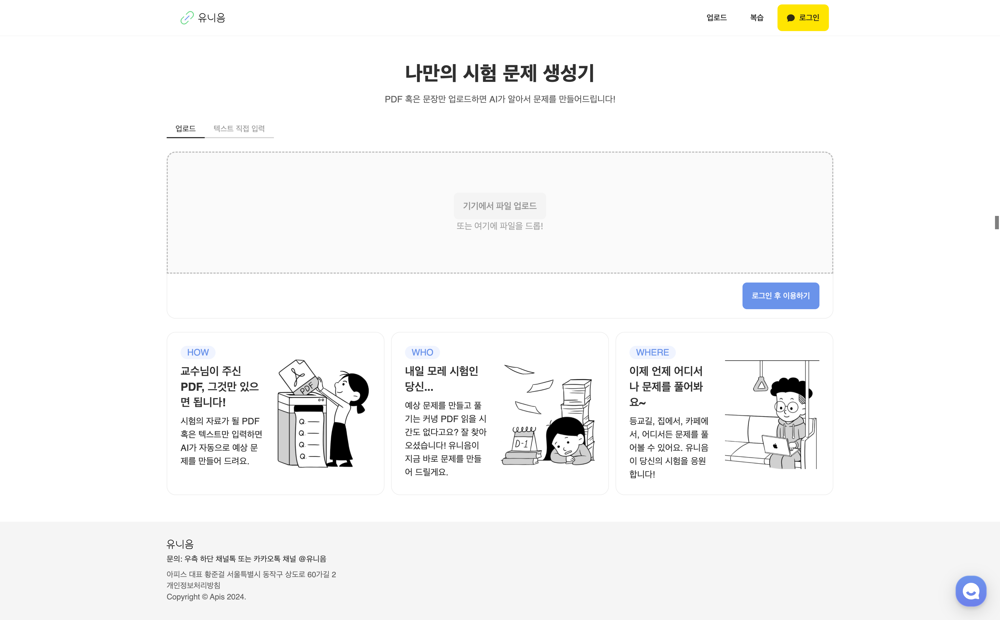

카카오 로그인으로 서비스를 이용할 수 있습니다.

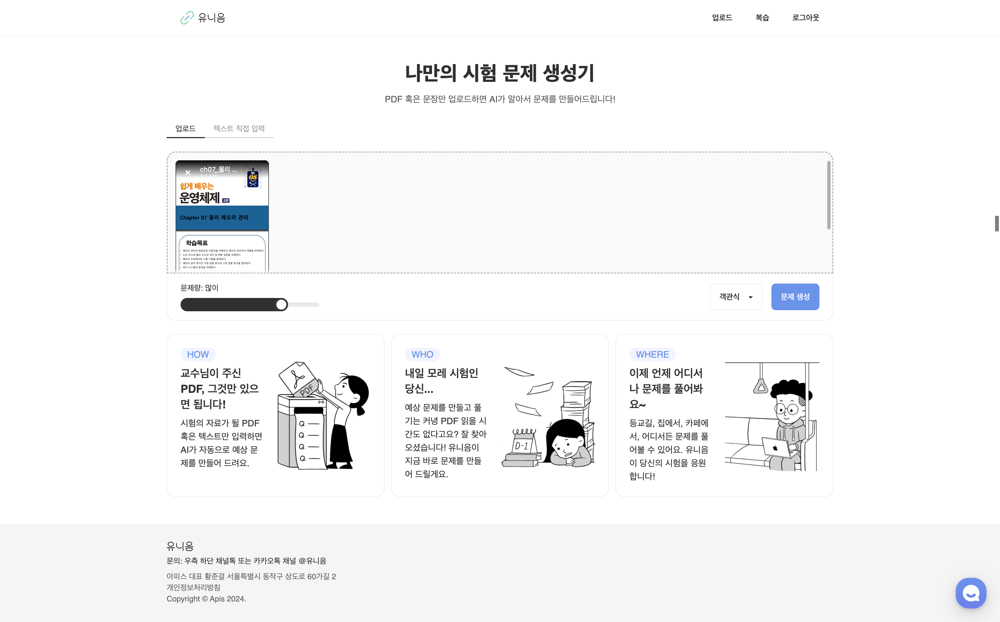

로그인을 하면 자료를 업로드할 수 있고, 문제 생성 양(5단계)과 문제 유형(객관식, 주관식)을 선택할 수 있습니다.

PDF를 업로드하지 않고도 텍스트 복사/붙여넣기로 문제를 생성할 수 있어요.

&nbsp;

#### 문제 생성이 완료되면 PDF로 다운로드할 수 있어요!

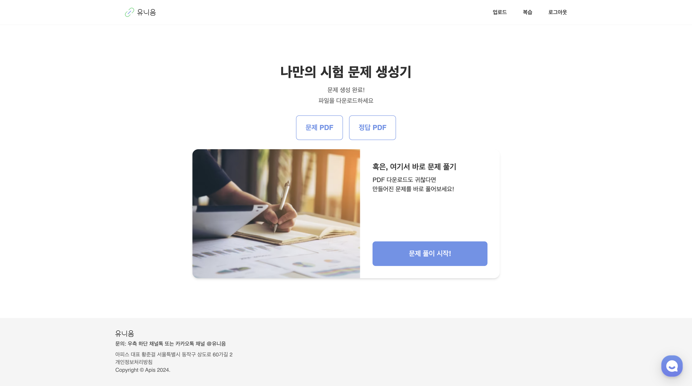

문제 생성이 완료되면, 문제 PDF와 정답 PDF를 각각 다운로드할 수 있습니다.

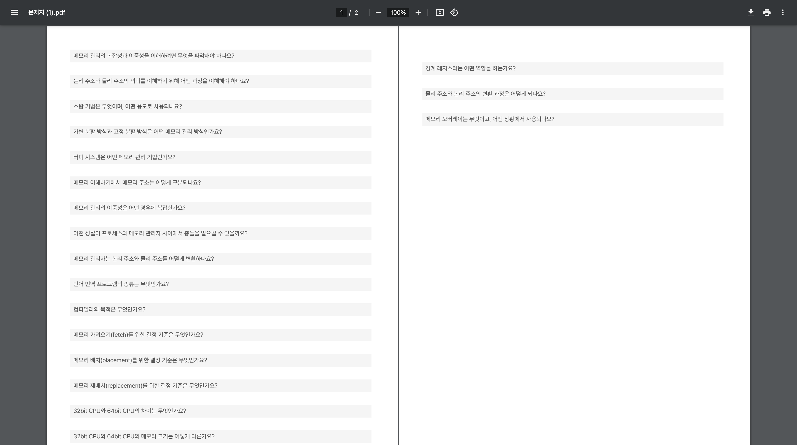

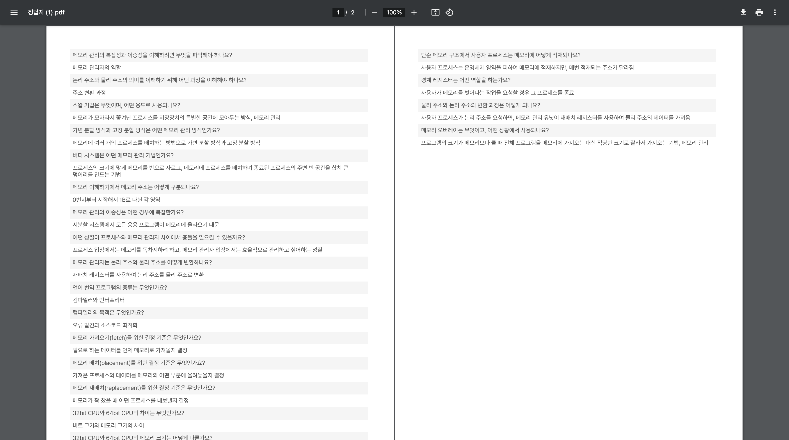

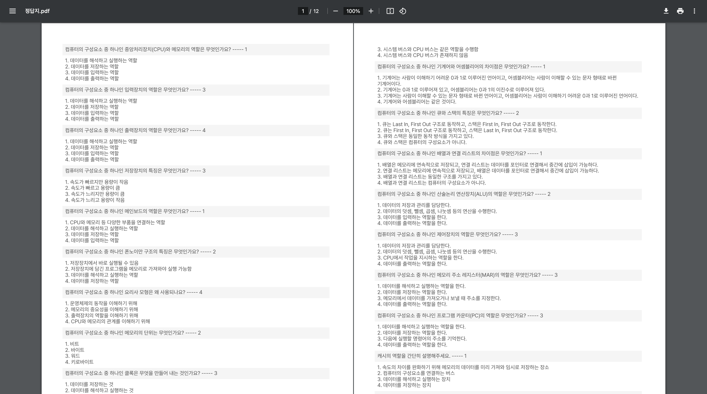

&nbsp;

#### PDF를 다운로드하지 않고 유니음에서 바로 문제를 풀어볼 수 있어요!

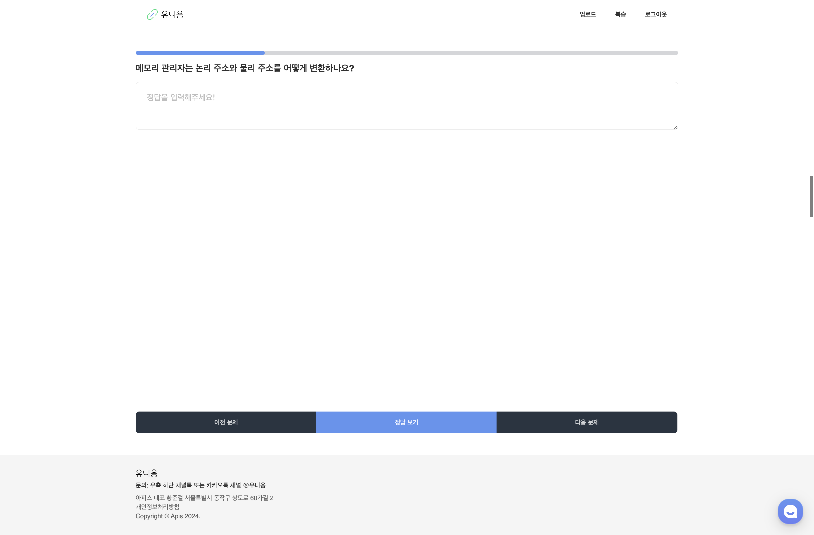

유니음에서 퀴즈 학습 기능을 제공합니다.

정답을 입력하고 확인하면, 입력한 내용을 기반으로 유니음이 피드백도 해줘요!

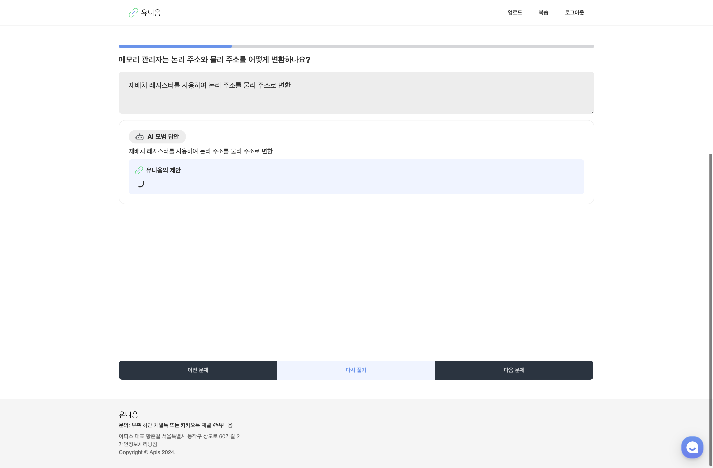

객관식 문제 풀이도 가능하답니다 😀

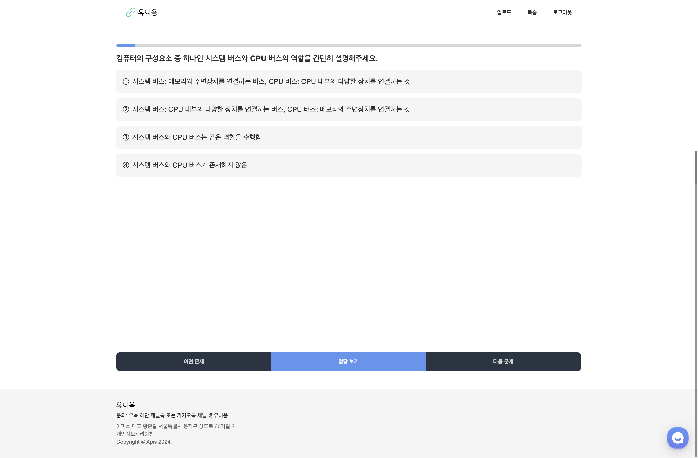

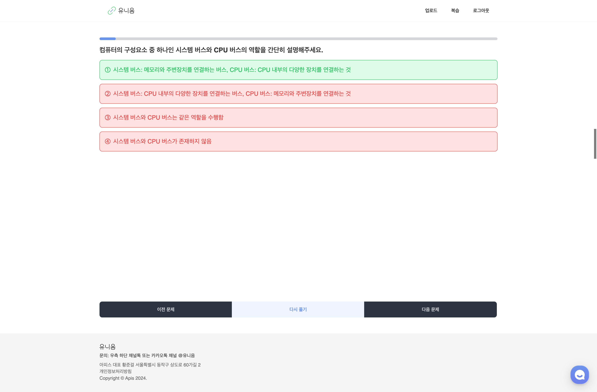

&nbsp;

#### 생성된 문제는 나중에 다시 볼 수 있어요!

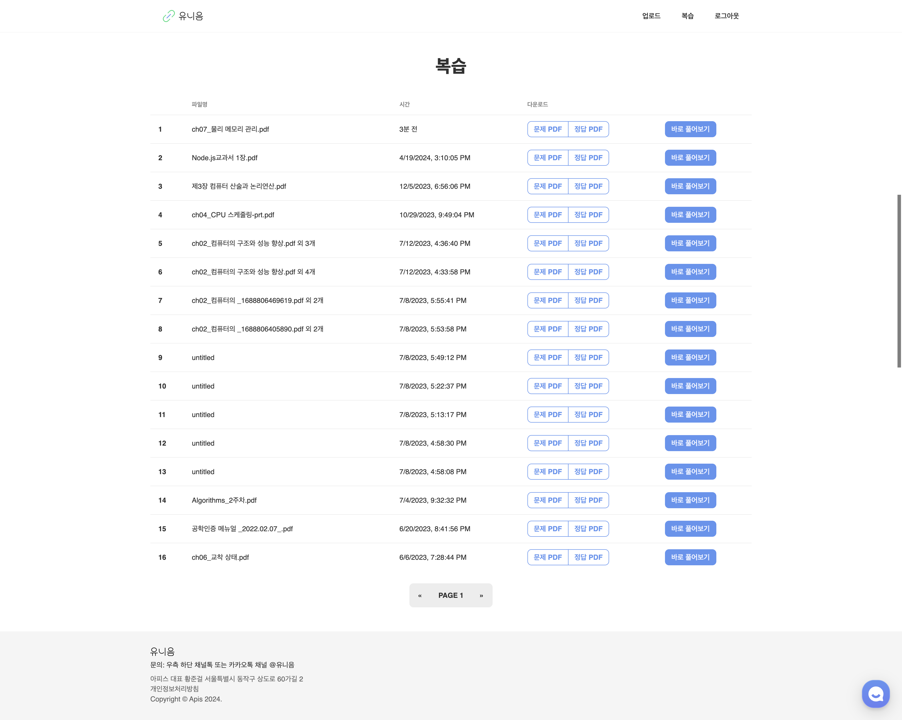

지금까지 생성한 모든 학습 자료는 복습 페이지에 저장됩니다!

PDF 다운로드와 퀴즈 학습 모두 언제든지 가능해요.

&nbsp;

### Team Member

- Product Manager : 황준걸
- Designer : 김지은
- Web : 조성원
- Server : 한재찬
